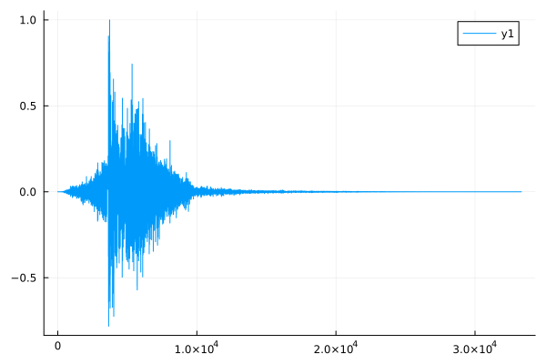
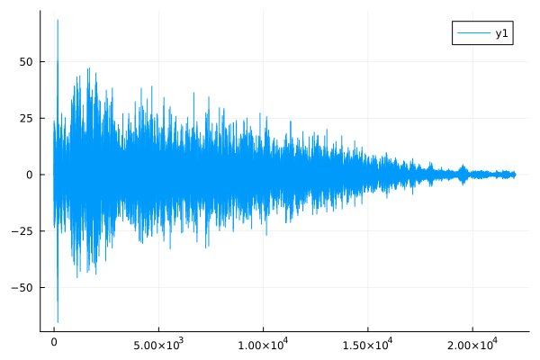
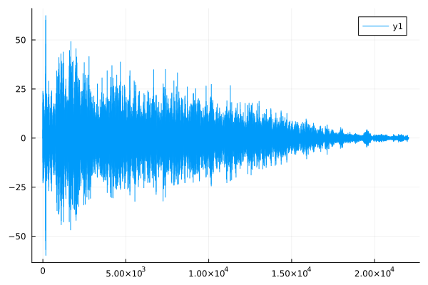
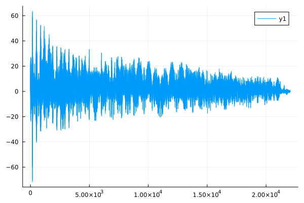

# Benchmarks de Fast Fourrier Transforms
## Introduction
Ce document va mesurer les performances de différentes
implémentations de l'algorithme de **Fast Fourrier Transform** dans 3 languges:
- Python
- R
- Julia

On utilisera une implémentation maison (dite naive)
et une implémentation d'un package répandu. Le but sera de comparer
les performances des languages entre eux.

## Donnée de test
On utilise un sample de clap pour notre test. La figure
ci-dessous affiche l'intensitée du signal en fonction du temps.

## Résultats
Les temps de calculs de la transformation de fourier mesurés sont les suivants:

 - `fft_builtin.R` a mis **9** millisecondes (16385 intensités générés)

 - `fft_scipy.py` a mis **9** millisecondes (16666 intensités générés)

 - `fft_fftw.jl` a mis **497** millisecondes (16385 intensités générés)

 - `fft_naive.py` a mis **670** millisecondes (16385 intensités générés)

 - `fft_naive.jl` a mis **2366** millisecondes (16385 intensités générés)

 - `fft_naive.R` a mis **2698** millisecondes (16385 intensités générés)

L'implémentation la plus rapide est celle de R, qui apelle probable
du C++ ou du C avec une librairie spécialisée dans les transformations
de fourrier rapides. Ensuite arrive scipy, puis julia (qui utilise
fftw et a donc un binding avec le C à gérer elle aussi).
Au final, on mesure plutôt l'efficacité du binding C en utilisant
des libraires. Regardons maintenant les résultats des implémentations
dites "naives", c'est à dire implémentation classique de l'algorithme fft
firectement dans le language.
Sans surprise, R est assez lent. Par contre, python est le plus rapide
des 3, ce qui est surprenant au vu de sa réputation.
On notera tout de même que ce benchmark mériterai à être répété avec d'autres version.

Les versions des différents interpréteurs utilisés sont les suivantes:

 - `fft_builtin.R` est en version **4.2.2**

 - `fft_scipy.py` est en version **3.10.9 (main, Dec 19 2022, 17:35:49) [GCC 12.2.0]**

 - `fft_fftw.jl` est en version **1.8.5**

 - `fft_naive.py` est en version **3.10.9 (main, Dec 19 2022, 17:35:49) [GCC 12.2.0]**

 - `fft_naive.jl` est en version **1.8.5**

 - `fft_naive.R` est en version **4.2.2**

## Comparaison visuelle
Nous allons maintenant, pour chaque fichier, produire une figure et comparer
visuellement les fréquences obtenues.

### FFT_BUILTIN.R

### FFT_SCIPY.PY

### FFT_FFTW.JL

### FFT_NAIVE.PY

### FFT_NAIVE.JL

### FFT_NAIVE.R

